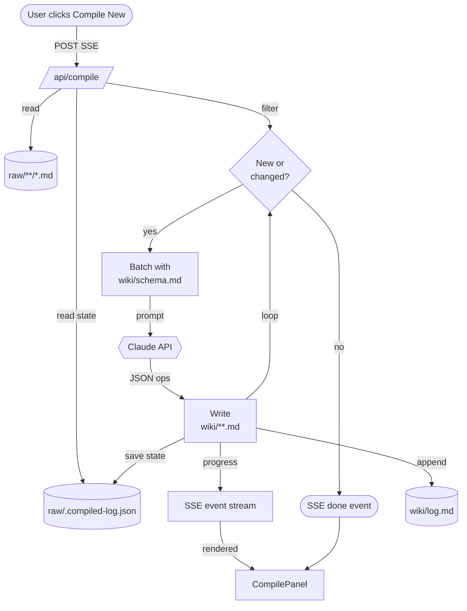

# compile-pipeline

The compile pipeline is the Karpathy LLM-Wiki core. Raw docs in raw/ are read, deduplicated against raw/.compiled-log.json, batched to Claude with wiki/schema.md as the system prompt, and written back as structured wiki pages. Each run appends to wiki/log.md. Streams SSE progress so the web UI CompilePanel shows live status. Incremental by default — full recompile is explicit.

## Diagram

