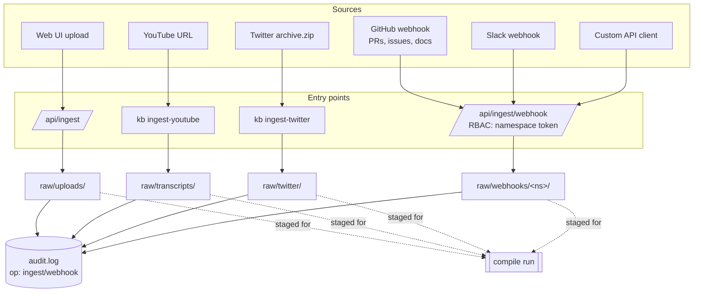

# ingest-flow

Ingest is how new content enters the vault. Four entry points converge on raw/: direct UI upload (/api/ingest), CLI commands (kb ingest-youtube, kb ingest-twitter), webhooks (/api/ingest/webhook with namespace RBAC), and GitHub Actions on merged PRs / closed issues / pushed docs. All writes are audited. Nothing is compiled until an explicit compile run — ingest and compile are decoupled so you can stage content before it becomes wiki.

## Diagram

