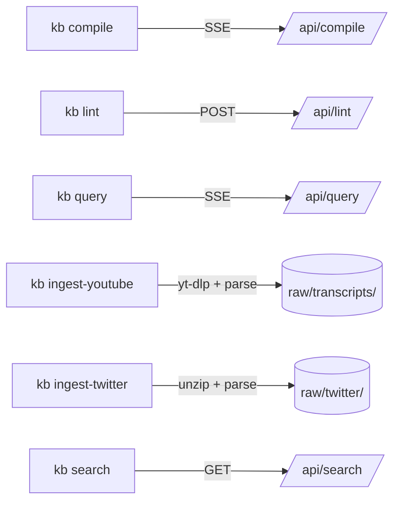

# overall-architecture/cli

Single-file Node CLI at cli/kb.js. Thin client over the web API — all real work happens in the Next.js routes. Commands: compile, lint, ingest-youtube, ingest-twitter, query, search. SSE-streaming commands parse events via fetch + ReadableStream reader.

## Diagram

