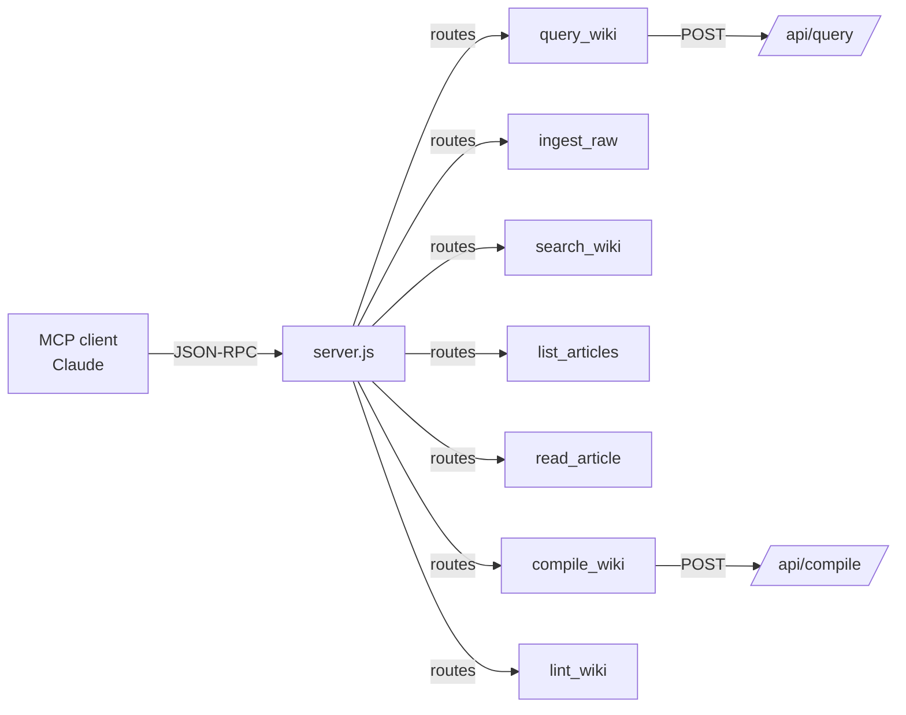

# overall-architecture/mcp-server

Model Context Protocol server at mcp/server.js. Exposes 7 tools so Claude (or any MCP client) can directly interact with the KB: query_wiki, ingest_raw, search_wiki, list_articles, read_article, compile_wiki, lint_wiki. Each tool is a thin wrapper over the corresponding /api/ route.

## Diagram

