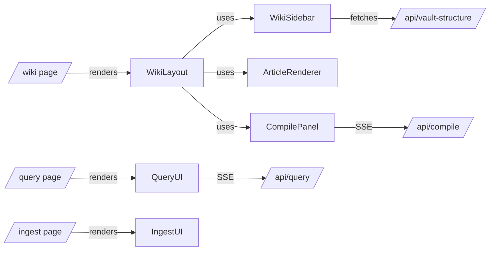

# overall-architecture/web-ui

Next.js 14 app at web/. Server-rendered wiki browser with client-side compile/query panels. Three main routes: /wiki (article browser with sidebar + TOC), /query (Ask AI chat UI), /ingest (upload material). WikiSidebar loads its tree from /api/vault-structure. CompilePanel streams SSE from /api/compile and renders a terminal-style log.

## Diagram

