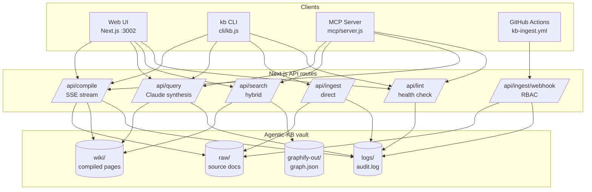

# overall-architecture

Agentic-KB is a Karpathy-pattern "LLM Wiki" knowledge base. Raw markdown (raw/) is compiled by Claude into a structured, persistent wiki (wiki/). Not RAG — the compile step is deliberate and auditable. Three entry points: Next.js web app (web/), CLI (cli/kb.js), and MCP server (mcp/server.js). Hybrid search combines keyword scanning with graph traversal over graphify's knowledge graph. Namespace-level RBAC, temporal decay + hotness ranking, append-only audit log, and scheduled lint round out the enterprise surface.

## Diagram

