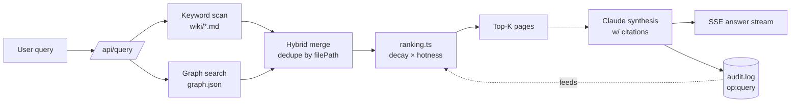

# query-pipeline

The query pipeline answers natural-language questions by running hybrid retrieval (keyword scanner + graph traversal), ranking results via temporal decay and hotness, then synthesizing an answer with Claude against the top-ranked wiki pages. Every query is logged to logs/audit.log with file hits — which feeds future hotness scoring. P2 target: the 10-stage RLM pipeline documented in docs/RLM_PIPELINE.md.

## Diagram

