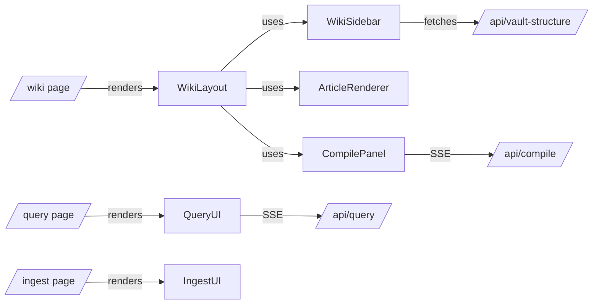

# oh-my-mermaid: Web UI Architecture

## Definition

**oh-my-mermaid** is a server-rendered wiki browser with AI query and ingest capabilities, built as a [Next.js 14](https://nextjs.org/) application located in the `web/` directory. It exposes three main routes and uses Server-Sent Events (SSE) for real-time streaming of compile and query output.

## Routes

| Route | Purpose | Key Component |
|---|---|---|
| `/wiki` | Article browser with sidebar and TOC | `WikiLayout` |
| `/query` | Ask AI chat interface | `QueryUI` |
| `/ingest` | Upload material into the knowledge base | `IngestUI` |

## Component Structure

### `/wiki` — WikiLayout

The `/wiki` route renders a `WikiLayout` that composes three child components:

- **`WikiSidebar`** — fetches the vault document tree from `/api/vault-structure` and renders a navigable file hierarchy.
- **`ArticleRenderer`** — renders the selected wiki article's content.
- **`CompilePanel`** — a client-side panel that opens an SSE connection to `/api/compile` and displays streaming output as a terminal-style log.

### `/query` — QueryUI

A chat UI that streams AI responses from `/api/query` via Server-Sent Events. Users can ask questions about the knowledge base and receive real-time streamed answers.

### `/ingest` — IngestUI

A simple upload interface backed by the ingest pipeline. Allows users to add new raw documents into the system.

## Architecture Diagram

## Why It Matters

The UI architecture cleanly separates concerns: static server-rendered article browsing lives in `WikiLayout`, while interactive AI-driven features (`CompilePanel`, `QueryUI`) use SSE to stream responses without blocking the page. This hybrid approach keeps the wiki fast and readable while still enabling live AI feedback.

## Key API Endpoints

| Endpoint | Consumer | Transport |
|---|---|---|
| `/api/vault-structure` | `WikiSidebar` | HTTP fetch (JSON tree) |
| `/api/compile` | `CompilePanel` | Server-Sent Events |
| `/api/query` | `QueryUI` | Server-Sent Events |

## See Also

- [LLM-Owned Wiki](concepts/llm-wiki.md) — the broader wiki pattern this UI implements
- [LLM Wiki Compile Pipeline](concepts/llm-wiki-compile-pipeline.md) — what `/api/compile` is orchestrating
- [Ingest Pipeline](concepts/ingest-pipeline.md) — what `/ingest` feeds into
