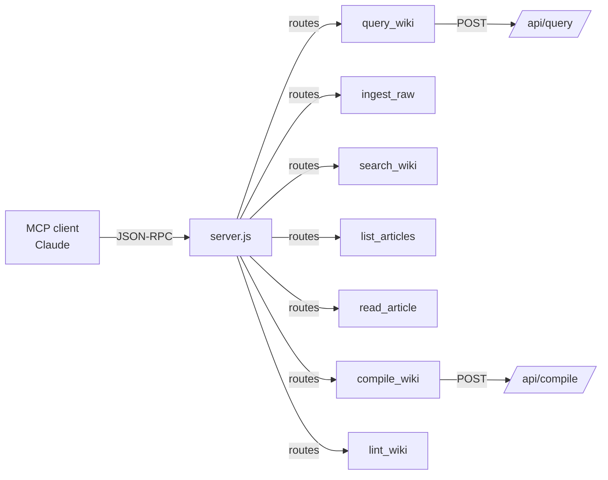

# [[mcp-ecosystem]] Ecosystem

The [[mcp-ecosystem]] ([[mcp-ecosystem]]) ecosystem encompasses the servers, clients, and tooling that expose structured capabilities to LLM agents via JSON-RPC.

## [[oh-my-mermaid]] [[mcp-ecosystem]] Server

The `oh-my-mermaid` project includes an [[mcp-ecosystem]] server at `mcp/server.js` that exposes **7 tools** so Claude (or any [[mcp-ecosystem]]-compatible client) can directly interact with the knowledge base:

| Tool | Description |
|---|---|
| `query_wiki` | Semantic query against the KB |
| `ingest_raw` | Ingest a new raw document |
| `search_wiki` | Full-text search across wiki pages |
| `list_articles` | List all wiki articles |
| `read_article` | Fetch a single wiki page |
| `compile_wiki` | Trigger compilation of raw docs into wiki pages |
| `lint_wiki` | Lint wiki pages for schema compliance |

Each tool is a **thin wrapper** over the corresponding `/api/` route — no logic lives in the [[mcp-ecosystem]] layer itself.

### Architecture

### Design Principle

The [[mcp-ecosystem]] server acts purely as a protocol translation layer — JSON-RPC in, HTTP API calls out. This keeps the surface area small and ensures all business logic stays in the API layer, making the server easy to maintain and test independently.

## See Also

- [MCP Framework](../frameworks/framework-mcp.md)
- [LLM-Owned Wiki](../concepts/llm-owned-wiki.md)
- [Tool Use](../concepts/tool-use.md)
- [Agent Loops](../concepts/agent-loops.md)
