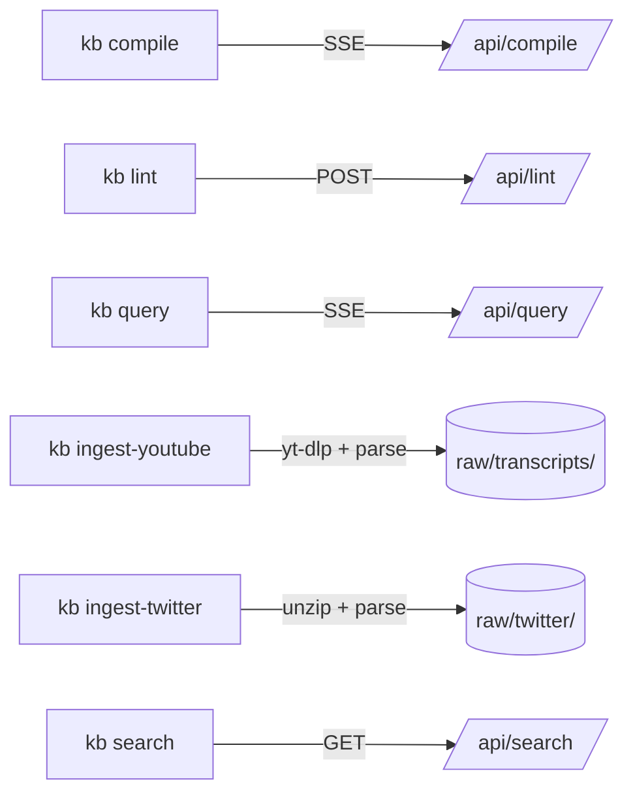

# Oh My Mermaid — KB CLI

**Oh My Mermaid ([[oh-my-mermaid]])** is the project that houses the Agentic KB toolchain. Its CLI entry point is a single-file Node.js script at `cli/kb.js`, acting as a thin client over a Next.js web API layer. All substantive processing occurs in the Next.js API routes — the CLI itself only handles I/O, streaming, and argument parsing.

## Architecture Overview

## CLI Commands

| Command | Transport | Target |
|---|---|---|
| `kb compile` | SSE (streaming) | `/api/compile/` |
| `kb lint` | POST | `/api/lint/` |
| `kb query` | SSE (streaming) | `/api/query/` |
| `kb ingest-youtube` | local: yt-dlp + parse | `raw/transcripts/` |
| `kb ingest-twitter` | local: unzip + parse | `raw/twitter/` |
| `kb search` | GET | `/api/search/` |

## Design Principles

- **Thin client**: The CLI delegates all logic to the API layer. It is a transport shim, not a business logic layer.
- **SSE streaming**: Long-running commands (`compile`, `query`) stream results via `fetch` + `ReadableStream` reader, enabling progressive output in the terminal.
- **Local ingestion**: Ingest commands (`ingest-youtube`, `ingest-twitter`) run locally against raw files before handing off to the API, keeping external-tool dependencies out of the server.

## See Also

- [LLM-Owned Wiki](../concepts/llm-owned-wiki.md)
- [LLM Wiki Pattern](../concepts/llm-wiki-pattern.md)
- [MCP Framework](../frameworks/framework-mcp.md)
