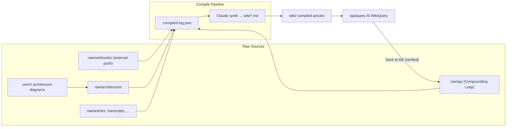

# oh-my-mermaid Integration

Auto-generate architecture diagrams of Agentic-KB (or any codebase) and ingest them as raw docs for compilation into wiki pages. Engineers querying the KB get visual architecture context alongside prose.

## One-time setup

```bash
npm install -g oh-my-mermaid
chmod +x scripts/ingest-omm.sh
```

## Workflow

1. **Scan** — In Claude Code, run the `/omm-scan` skill inside this repo. It generates an `.omm/` directory with Mermaid diagrams from multiple perspectives (overall structure, data flow, integrations, etc.).

2. **Ingest** — Run the helper script:
   ```bash
   ./scripts/ingest-omm.sh
   ```
   Each perspective becomes a frontmattered markdown file in `raw/architecture/` tagged with `architecture, mermaid, autogen`.

3. **Compile** — Hit **Compile New** in the web UI (http://localhost:3002) or run `kb compile`. The compiler treats diagrams like any other raw doc and weaves them into the wiki.

4. **Query** — Ask the KB things like "show me how the compile pipeline flows" and it will pull the relevant Mermaid diagram plus prose explanation.

## Re-running

`/omm-scan` is cheap to re-run. After major refactors:
```bash
rm -rf .omm
# run /omm-scan in Claude Code
./scripts/ingest-omm.sh
```

The compile log (`raw/.compiled-log.json`) will pick up the new files and skip the unchanged ones.

## Ingest flow (with Compounding Loop)



The `raw/qa/` loop is the system's memory of its own answers: every verified Q&A becomes a raw doc, compiled into the wiki, and eligible to be cited by the next query. `verified: true` in frontmatter triggers a ×1.25 ranking boost (see `web/src/lib/ranking.ts`).

## Tag convention

All auto-generated architecture docs carry `tags: [architecture, mermaid, autogen]`. Use this to filter them in search or exclude them from lint orphan detection (they're autogen and don't need inbound links).
